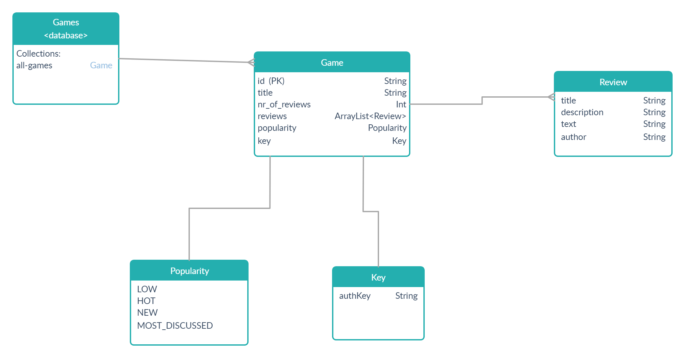

# GameRevQuery
kotlin based client server app, implementing a game review database

## Client operations on Games

 - Model: **src/main/kotlin/com/app/model**
 - Repositories: **src/main/kotlin/com/app/repository**
 - Services: **src/main/kotlin/com/app/service**
 - Controllers: **src/main/kotlin/com/app/controller**
 - Config: **src/main/kotlin/com/app/config**

## Test
 - Test your services using  [Postman](https://www.postman.com/): **postman-requests**
 
	1. Post: `http://localhost:9000/games/needForSpeed`
	2. Put: `http://localhost:9000/games/callOfDuty`
		    body: 
				    {
	"review_title": "best Game",
	"description": "very good game",
	"text": "your text",
	"author": "User2"
			}
	3. Get: `http://localhost:9000/games`
	4. Patch: `http://localhost:9000/games/AOE`
			body
			{
	"review_title": "review2",
	"description": "ahah",
	"text": "uuuuuuu",
	"author": "User2"
			}
	5. Delete:  `http://localhost:9000/games/403`
		body
		{
	 "authKey": "YourSecretKey!"
		}

## Other tasks

  - Implement logger: **src/main/kotlin/com/app/service/GameService.kt**
  - Document your services using [Swagger](https://swagger.io/) or a similar tool
 

# Entity Relationship diagram

